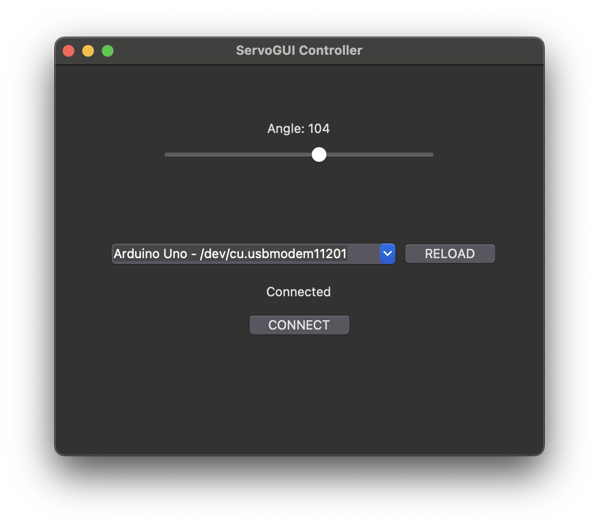

# Arduino Servo GUI

This project is a Python-based application that allows users to control a servo motor connected to an Arduino via a
serial port.
 
The application features a graphical user interface (GUI) built with Tkinter,
which lets users adjust the servo motor’s angle with a slider.

### Tools and Libraries Used

- Python
- Tkinter - Used for creating the graphical user interface.
- PySerial - Used for serial communication between the Python application and the Arduino board.
- C++ - Arduino sketch

 
